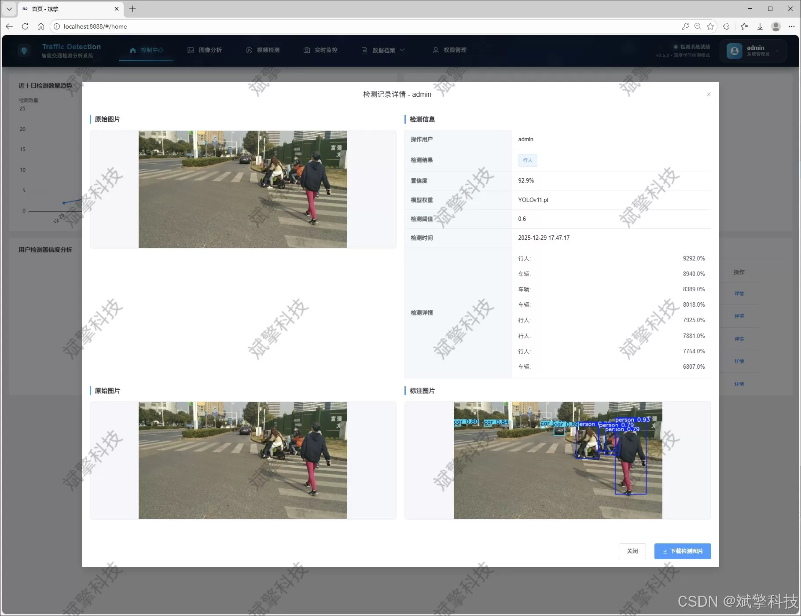
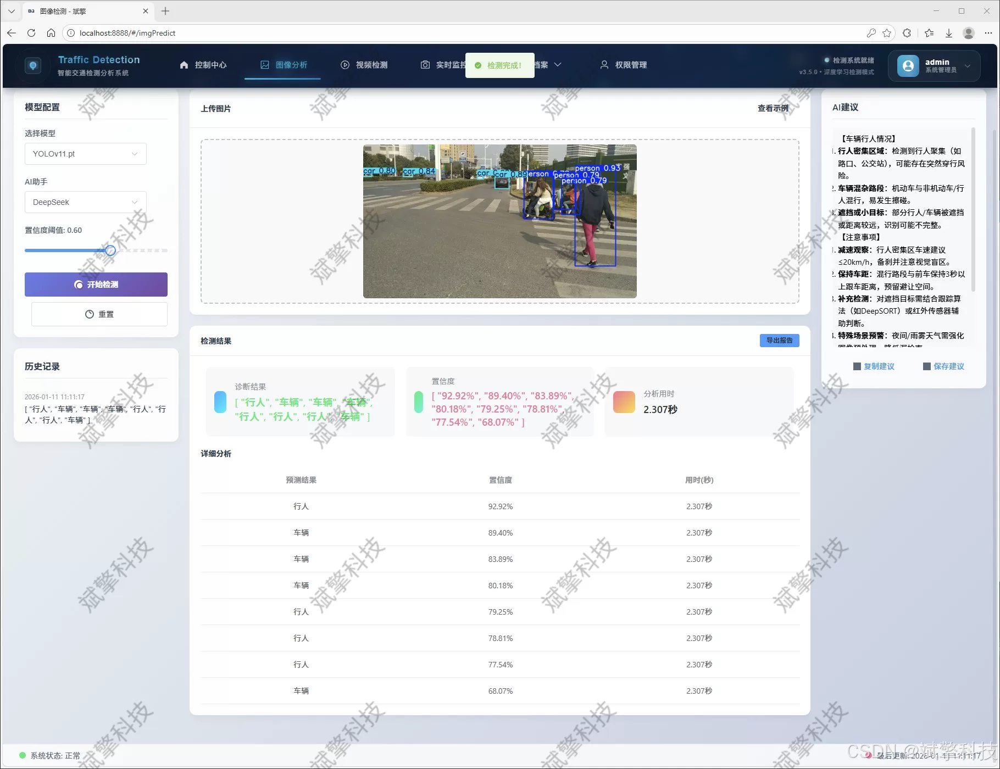
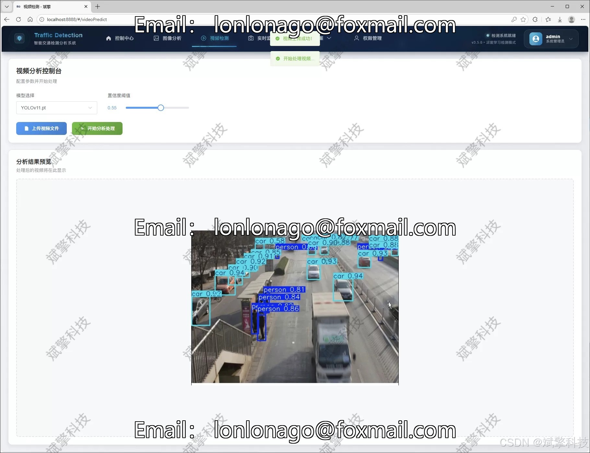
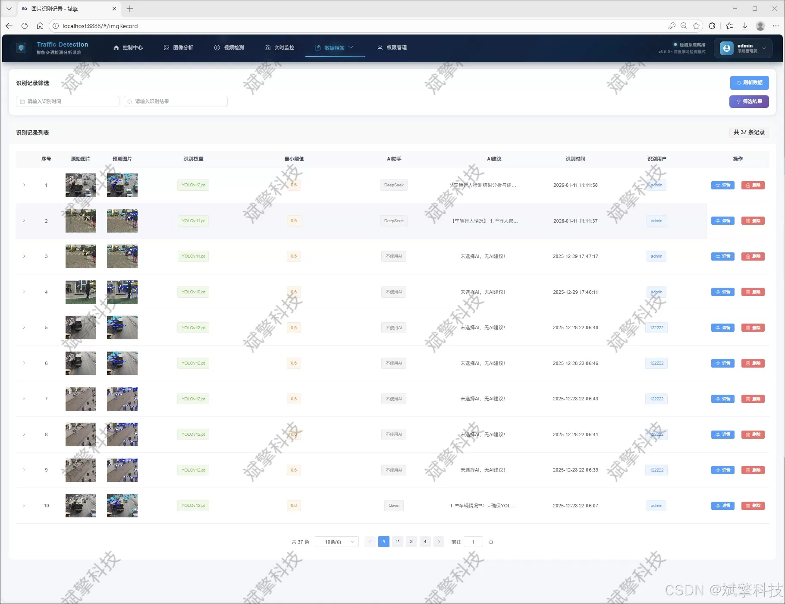
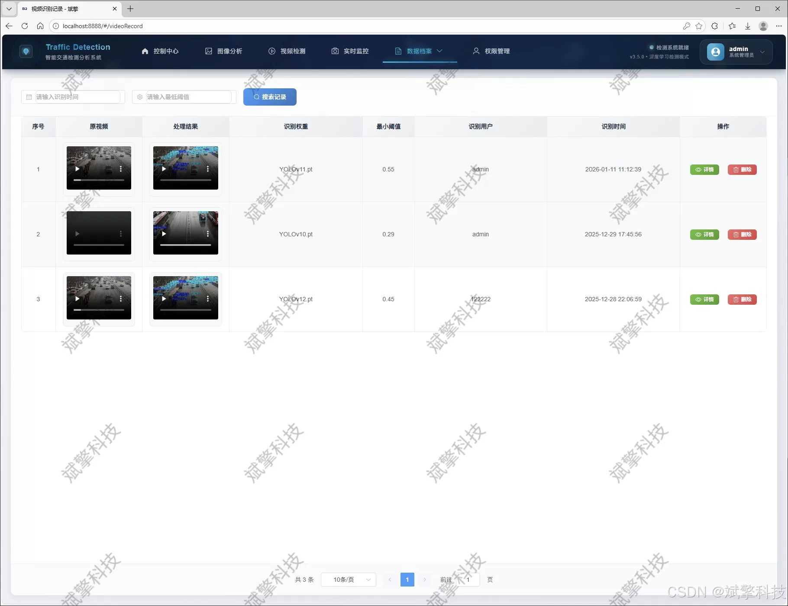
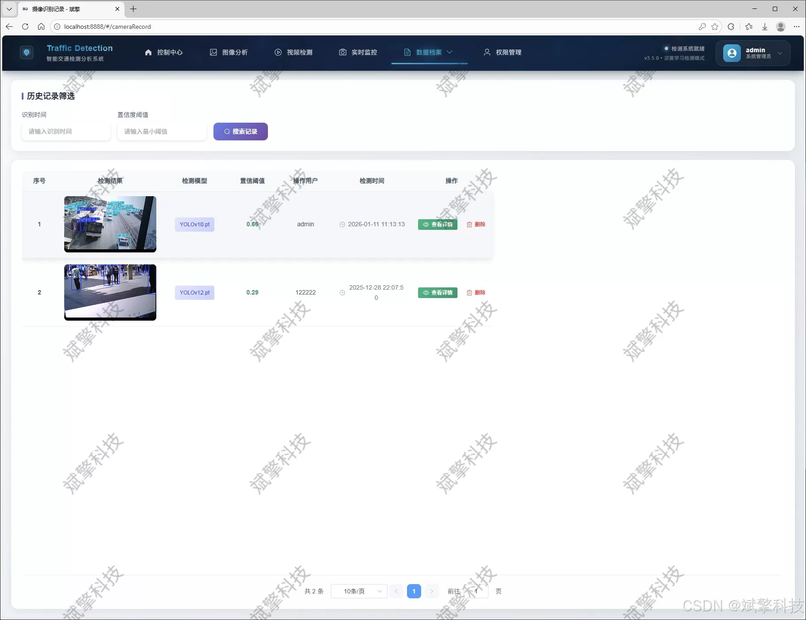

# YOLO Multi-Model Intelligent Detection System

## Body

YOLO (You Only Look Once) is a deep learning-based object detection system that uses convolutional neural networks to detect objects in real-time. It has been widely used in various fields such as autonomous driving, surveillance, and medical imaging.

The YOLO system consists of three main components: the backbone network, the region proposal network, and the classification network. The backbone network is a convolutional neural network that extracts features from the input image. The region proposal network generates bounding boxes around the objects in the image. The classification network classifies the objects in the bounding boxes.

The YOLO system has several advantages over traditional object detection methods. First, it can detect objects in real-time, which is crucial for applications such as autonomous driving. Second, it can handle large amounts of data efficiently, which is important for applications such as surveillance. Third, it can detect objects of different sizes and shapes, which is important for applications such as medical imaging.

Overall, the YOLO system is a powerful tool for object detection that has had a significant impact on various industries.

(Full product description was not available from the source page.)

## Images

## Payment

Here is a pay link on Stripe ( https://buy.stripe.com/3cs8yP7sY87d0vu9AB ). Please contact me lonlonago@foxmail.com after funding $89, and I will send you a complete data files , thank you!

